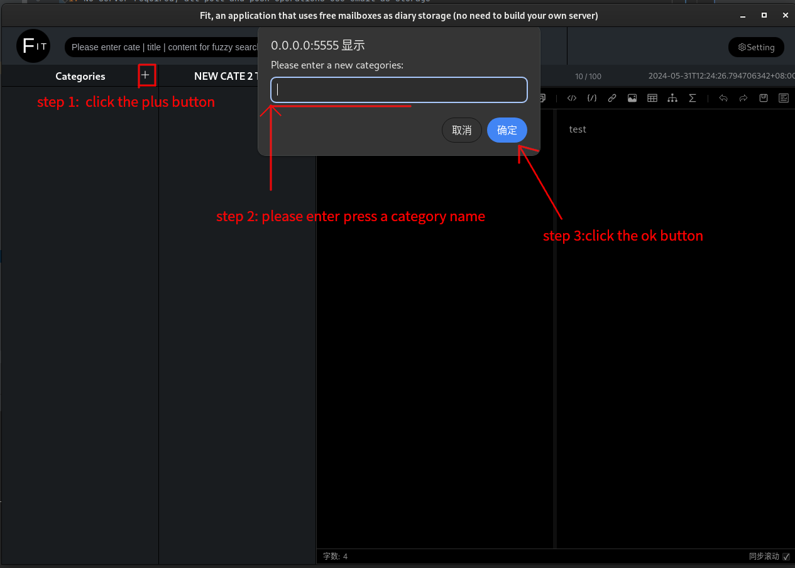
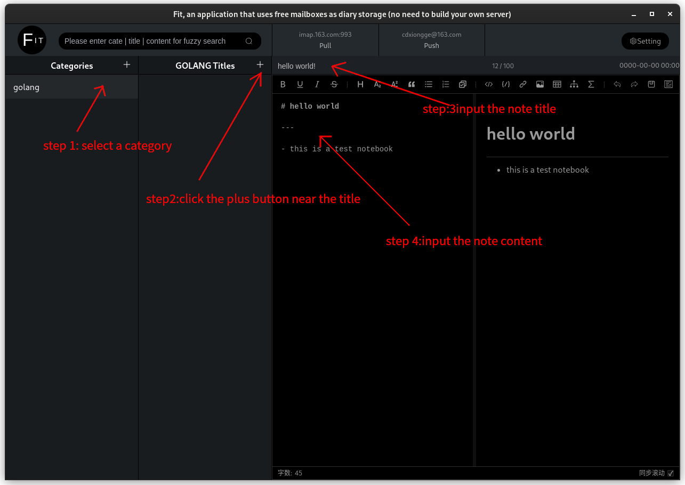

# fit

> fit is a notebook program for programmers using Debian and Ubuntu. It has the following features:
 
1. No server required, all pull and push operations use email as storage
2. Out of the box
3. Simple UI without any complex functions

### FAQ

#### how to create category?

#### how to create a new note?

